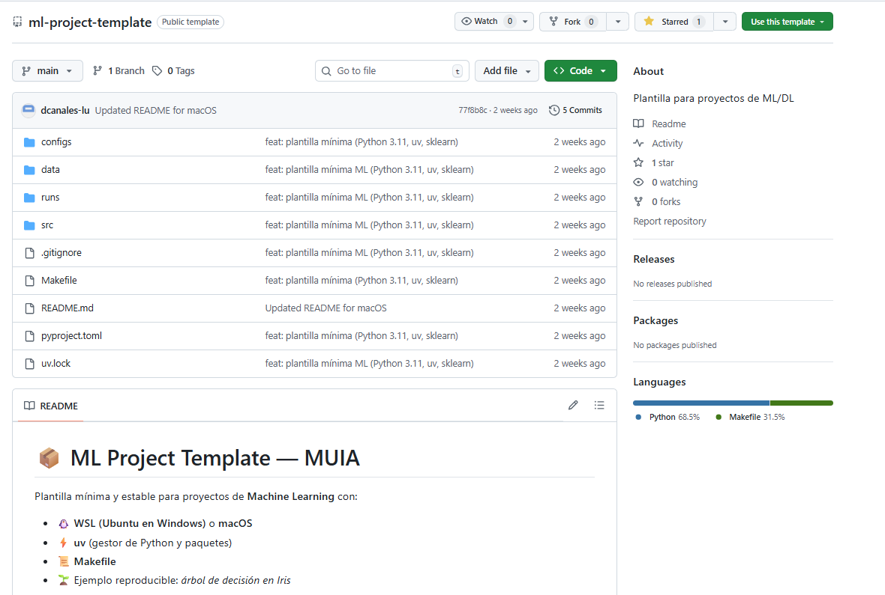

# 📦 ML Project Template — MUIA

Plantilla mínima y estable para proyectos de **Machine Learning** con:

- 🐧 **WSL (Ubuntu en Windows)** o **macOS**
- ⚡ **uv** (gestor de Python y paquetes)
- 📜 **Makefile**
- 🌱 Ejemplo reproducible: *árbol de decisión en Iris*

👉 **Objetivo de onboarding**: que cualquier alumno, **desde cero en Windows o Mac**, pueda ejecutar:

```bash
make setup
make test
make train

```

---

## 🚀 0) Instalación inicial

### 🖥️ Windows → WSL + Ubuntu

1. **Activar WSL** (solo una vez)

   Abre **PowerShell como administrador** y ejecuta:

   ```powershell
   wsl --install -d Ubuntu

   ```

   Reinicia si lo pide. Al primer arranque, crea usuario/contraseña.
2. **Actualizar Ubuntu**

   ```bash
   sudo apt update && sudo apt upgrade -y

   ```
3. **Instalar Git y utilidades**

   ```bash
   sudo apt install -y git curl make

   ```
4. **Configurar Git**

   ```bash
   git config --global user.name "Tu Nombre"
   git config --global user.email "tu_email@loyola.es"

   ```

   Comprueba la configuración:
   ```bash
   git config --list
   ```

6. **Configurar SSH con GitHub (recomendado)**

   ```bash
   ssh-keygen -t ed25519 -C "tu_email@loyola.es"
   cat ~/.ssh/id_ed25519.pub

   ```

   Copia la clave pública en → [GitHub → Settings → SSH and GPG keys → New SSH key]
   - Prueba de conexión con Github:
   ```bash
   ssh -T git@github.com
   ```
   Si conecta correctamente:
   ```bash
   Hi username! You've successfully authenticated, but GitHub does not provide shell access.
   ```

    Si tienes varias claves, crea `~/.ssh/config`:
   ```
   Host github.com
     HostName github.com
     User git
     IdentityFile ~/.ssh/id_ed25519
     IdentitiesOnly yes
   ```

   Esto se demuestra útil en el caso de tener una cuenta equivalente en Gitlab:
    - Añade la clave pública anterior o crea otro par pública/privada si quieres usar otra diferente para Gitlab
    - Copia la clave pública en Gitlab → Settings → SSH keys

    Edita el fichero `~/.ssh/config` para añadir el nuevo host:
    ```
    Host github.com
        HostName github.com
        User git
        IdentityFile ~/.ssh/id_ed25519
        IdentitiesOnly yes

    Host gitlab.com
        HostName gitlab.com
        User git
        IdentityFile ~/.ssh/id_ed25519_gitlab
        IdentitiesOnly yes
    ```
    Y comprueba la conexión con ambos hosts:
    ```bash
    ssh -T git@github.com
    ssh -T git@gitlab.com
    ```

7. **Instalar uv**

   ```bash
   curl -LsSf https://astral.sh/uv/install.sh | sh
   ```
   Si Ok verás las siguientes intrucciones en pantalla:
   ```bash
   To add $HOME/.local/bin to your PATH, either restart your shell or run:

   source $HOME/.local/bin/env (sh, bash, zsh)
   source $HOME/.local/bin/env.fish (fish)
   ```
   Añade la ruta al fichero de tu usuario, ejecútalo y haz la comprobación con el comando de versión de `uv`:
   ```bash
   echo 'export PATH="$HOME/.local/bin:$PATH"' >> ~/.bashrc
   source ~/.bashrc
   uv --version
   ```
  Output: ```uv 0.8.17```

---

### 🍎 macOS (Intel / Apple Silicon)

1. **Instalar Homebrew** (si no lo tienes):

   ```bash
   /bin/bash -c "$(curl -fsSL https://raw.githubusercontent.com/Homebrew/install/HEAD/install.sh)"

   ```
2. **Paquetes base**

   ```bash
   brew install git make curl

   ```
3. **Configurar Git**

   ```bash
   git config --global user.name "Tu Nombre"
   git config --global user.email "tu_email@loyola.es"

   ```
4. **SSH con GitHub (recomendado)**

   ```bash
   ssh-keygen -t ed25519 -C "tu_email@loyola.es"
   cat ~/.ssh/id_ed25519.pub
   ```
   Por defecto, el nombre del par de ficheros de la clave es el nombre del algoritmo `ed25519`. Si quieres darle un nombre específico:
   ```bash
   ssh-keygen -t ed25519 -f ed25519_gitlab -C "tu_email@loyola.es"


   Lo que vemos en pantalla es la clave pública (que no es necesaria en el equipo local). El otro fichero (mismo nombre, pero sin extensión) `id_ed25519` es la clave privada, que sólo debe estar en nuestro equipo local.

   Añádela en GitHub → Settings → SSH and GPG keys.
   - Prueba de conexión con Github:

   ```bash
   ssh -T git@github.com
   ```

5. **Instalar uv**

   ```bash
   curl -LsSf https://astral.sh/uv/install.sh | sh
   echo 'export PATH="$HOME/.local/bin:$PATH"' >> ~/.zshrc
   source ~/.zshrc
   uv --version

   ```
6. Instalar make:
```bash
sudo apt install make
```
---

## 🐍 1) Python por defecto (3.11)

El curso usa **Python 3.11** (máxima compatibilidad).

Instala (si no lo tienes):

```bash
uv python install 3.11

```

> ⚠️ El Makefile ya usa 3.11 por defecto.

---

## 📂 2) Crear tu repositorio desde la plantilla

1. Entra en Github **ml-project-template** → pulsa **Use this template** → **Create a new repository**.



2. Clona tu repo en `~/code`:

```bash
mkdir -p ~/code && cd ~/code
git clone git@github.com:<tu_usuario>/<tu_repo>.git
cd <tu_repo>
```

---

## ⚡ 3) Quickstart del proyecto

```bash
make setup   # crea el entorno 3.11 e instala dependencias
```
El output te muestra la información de lo que se instala:
```python
uv python install 3.11
uv venv --python 3.11 || true
Using CPython 3.11.13
Creating virtual environment at: .venv
Activate with: source .venv/bin/activate
uv pip install --upgrade pip
Resolved 1 package in 182ms
Prepared 1 package in 368ms
Installed 1 package in 83ms
 + pip==25.2
uv sync
Resolved 7 packages in 3ms
      Built ml-project-template @ file:///home/ubuntu/code/muia-ml-project
Prepared 7 packages in 3.69s
Uninstalled 1 package in 20ms
Installed 7 packages in 97ms
 + joblib==1.5.2
 + ml-project-template==0.1.0 (from file:///home/ubuntu/code/muia-ml-project)
 + numpy==2.3.2
 - pip==25.2
 + pyyaml==6.0.2
 + scikit-learn==1.7.1
 + scipy==1.16.1
 + threadpoolctl==3.6.0
```
Comprobación de la comprobación y proyecto ML de test (Iris):
```bash
$ make test    # verificación rápida (scikit-learn)

uv run python -c "import sklearn; import sys; print('OK sklearn', sklearn.__version__); sys.exit(0)"
OK sklearn 1.7.1

$ make train   # entrena DecisionTree en Iris`

uv run python -m src.app.train
accuracy=1.0000
artefactos en: runs/20250914_123651
```

- 📊 Resultados en `runs/AAAAmmdd_HHMMSS/`

  (incluye `model.joblib` y `metrics.json`)

👉 Si quieres probar rápido: edita `configs/config.yaml` (ej. `max_depth`) y vuelve a ejecutar `make train`.

---

## 🗂️ 4) Estructura mínima del repo

```
.
├── configs/           # configuración (YAML)
├── data/              # datos locales (ignorado en Git)
├── runs/              # artefactos/outputs (ignorado en Git)
├── src/app/train.py   # script de entrenamiento mínimo
├── Makefile           # setup/test/train
├── pyproject.toml     # deps y metadatos (uv/PEP 621)
└── .gitignore

```

✅ Reglas:

- No subas datos pesados (`data/` está en `.gitignore`).
- Commits pequeños; usa ramas `feat/...`, `fix/...`.

---

## 🔄 5) Cambiar de versión de Python (ej. 3.12)

### Opción A (solo para tu entorno)

```bash
uv python install 3.12
make setup PY=3.12

```

### Opción B (proyecto entero → default 3.12)

- En `pyproject.toml`:

  ```toml
  requires-python = "==3.12.*"

  ```
- En `Makefile`:

  ```makefile
  PY ?= 3.12

  ```
- Regenera entorno:

  ```bash
  rm -rf .venv
  make setup

  ```

Para volver: haz lo mismo con 3.11.

---

## ❓ 6) Preguntas frecuentes

- **❌ Permission denied (publickey)**

  → Añade tu clave SSH a GitHub y clona por SSH.
- **❌ uv: command not found**

  → Abre nueva terminal o ejecuta `source ~/.bashrc` / `~/.zshrc`.
- **📂 ¿Dónde están mis archivos?**

  → Trabaja siempre en `~/code/...` (Linux).

  Evita rutas `/mnt/c/...` o iCloud/Dropbox/OneDrive → **pierdes rendimiento y fiabilidad**.

---

## ANEXO: Glosario y explicaciones

### A. Ejecutar comando `sudo`sin contraseña
Edita el fichero de configuración con seguridad:

   ```bash
   sudo visudo
   ```

   (usa siempre `visudo`, nunca edites directamente `/etc/sudoers`, porque valida la sintaxis).

2. Añade al final:
```bash
tu_usuario_ubuntu ALL=(ALL) NOPASSWD:ALL
```


✅ **Verificación**:
Después de configurar, ejecuta `sudo -l`

y verás listados tus permisos, incluyendo `NOPASSWD`.

---

### B. Ficheros `.bashrc` vs `.profile`

* **`.profile`** → configuración **global** de la sesión (se carga al iniciar sesión).
* **`.bashrc`** → configuración **interactiva** de Bash (alias, funciones, prompt).


| Característica        | `.bashrc`                                                               | `.profile`                                                            |
| --------------------- | --------------------------------------------------------------------------- | ----------------------------------------------------------------------- |
| **Cuándo se ejecuta** | Cada vez que abres una **shell interactiva no-login** (ej. abrir terminal). | Al iniciar una **shell de login** (ej. entrar en el sistema o por SSH). |
| **Frecuencia**        | Muchas veces, cada nueva terminal.                                          | Una sola vez al inicio de la sesión.                                    |
| **Uso típico**        | Alias, funciones, colores del prompt, atajos de comandos.                   | Variables de entorno globales (PATH, JAVA\_HOME, EDITOR).               |
| **Relación**          | Solo afecta a Bash.                                                         | Puede invocar a `.bashrc` para cargar también sus ajustes.              |
| **Ejemplo**           | `alias gs="git status"`                                                     | `export PATH="$HOME/bin:$PATH"`                                         |

Para que `.profile` llame automáticamente a `.bashrc`, que no se ejecuta en el login, comprueba en tu archivo `~/.profile` que está presente este bloque de código:

```bash
# Variables de entorno globales
export PATH="$HOME/bin:$PATH"
export EDITOR=nano

# Si existe, cargar también ~/.bashrc
if [ -f "$HOME/.bashrc" ]; then
    . "$HOME/.bashrc"
fi
```

---

### C. Python nativo
En Ubuntu (comprueba la versión en WSL con `lsb_release -a`), ya viene preinstalado Python. Localiza la ruta:
```bash
$ which python3
/usr/bin/python3
```
Si intentas llamar a `python` verás que da error, y es porque no está apuntando por defecto a `python3`.
De esta forma, al no estar definido por defecto, aseguramos que `python` apunte a la ubicación y versión de `uv`:
```bash
$ which uv
/home/ubuntu/.local/bin/uv
```
---

### D. Carga en Visual Studio el repositorio clonado en WSL 

**🔹 Opción 1: Usar la extensión oficial `WSL`**

1. Abre VS Code en Windows.
2. Instala la extensión **WSL** (de Microsoft).
3. Una vez instalada, abajo a la izquierda aparecerá un botón verde → haz clic en **“Open a Remote Window”**.
4. Selecciona **“Connect to WSL”**.
5. Desde ahí puedes:

   * Abrir una carpeta existente en tu WSL (`/home/usuario/mi-repo`).
   * O clonar directamente un repositorio dentro de WSL con Git:

     ```bash
     git clone git@github.com:usuario/repo.git
     cd repo
     code .
     ```

   > El `code .` abre la carpeta actual de WSL directamente en VS Code de Windows, usando el servidor remoto de la extensión.

---

**🔹 Opción 2: Abrir repos desde Windows, pero trabajar en WSL**

* Si ya clonaste tu repo en `/home/usuario/...` dentro de WSL, puedes navegar ahí con:

  ```bash
  cd ~/mis-repositorio
  code .
  ```
* El comando `code .` invoca VS Code en Windows pero conectado al entorno WSL (si tienes la extensión Remote instalada).

