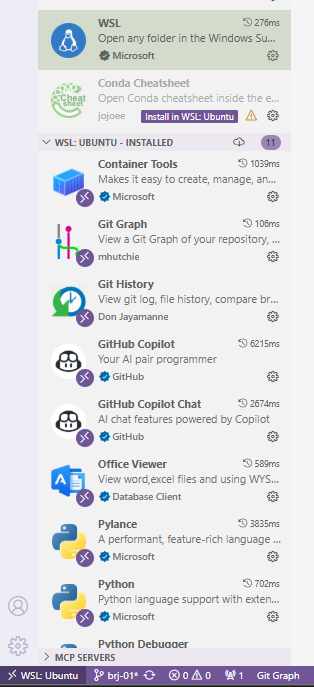

## 1. Conectar a WSL

- Instala la extensión `WSL` tal como se aprecia en la siguiente imagen:
  
- En la esquina inferior izquierda verás un pequeño botón `><`. Haz click y se abrirá una nueva ventana de VSC que apunta al entorno Ubuntu de WSL
- Abre la carpeta `/home/ubuntu/code` donde verás el repositorio de la plantilla sobre el que venimos trabajando

> **NOTA**: Trabajar desde VSC es la opción recomendada, ya que mucho más cómodo que hacerlo desde la terminal

## 2. Extensiones recomendadas

Tenemos dos entornos diferentes de VSC en Windows (en Mac es único, ya que el local es donde trabajamos directamente).
A continuación listamos las extensiones mínimas recomendadas para trabajar de una forma integrada sin necesidad de salir de VSC:

- **WSL**, sólo en el entorno local
- **UV Toolkit**: se trata de una extensión oficial del ecosistema **uv**.
  * Integra en VS Code las funciones principales de `uv`: creación/activación de entornos, instalación de paquetes, ejecución de scripts, gestión de lockfiles.
  * Muestra información contextual sobre el entorno Python usado por el proyecto.
  * Facilita ejecutar comandos `uv` sin salir del editor.

Aquí tienes la traducción literal de cada extensión:

* **Python**: Una extensión de Visual Studio Code con soporte completo para el lenguaje Python (para todas las versiones de Python con soporte activo), que proporciona puntos de acceso para que otras extensiones se integren sin problemas y ofrezcan soporte para IntelliSense (Pylance), depuración (Python Debugger), formateo, linting, navegación de código, refactorización, explorador de variables, explorador de tests, gestión de entornos (NUEVA extensión Python Environments).

* **Python Debugger**: Una extensión de Visual Studio Code que soporta la depuración de Python con debugpy.

* **Python Environments**: Entornos de Python.

* **Container tools (Docker)**: Herramientas de contenedores (Docker).

* **Jupyter**: Jupyter.

* **Git Graph**: Ver un gráfico de Git de tu repositorio, y realizar fácilmente acciones de Git desde el gráfico.

* **Git History**: Para ver el histórico de modificaciones sobre un fichero dado.

